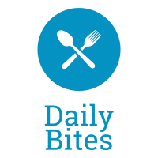

  

<h1 align="center" font="tradegothic">
  Daily Bites (mealmate-cmsi402 GitHub Repo)
</h1>

### By: Breelyn Betts, Maya Dahlke, Adriana Donkers, Henno Kublin, & Lexi Weingardt

Click [here](https://github.com/AdrianaDonkers/401-chatbot) to view the Chatbot repository.

**What is Daily Bites?**

Other nutrition apps require extensive data entry, focus on weight loss or caloric intake (which can actually hinder goals), and have limited functionality. 

Daily Bites is a nutrition app that emphasizes eating a balanced diet rather than caloric intake. It features natural language processing in the chatbot to provide a nutritionist-like experience. Additionally, it includes recommended recipes tailored to each user's diet and preferences. 

**Tech Stack**

* SwiftUI (Xcode) - A tool that allows you to build user interfaces across all Apple platforms.
* AWS - A robust cloud platform with an immense portfolio of services.
* Postgres - An open source object-relational database management system.
* Flask - A Python web framework used for building web applications.
* Rasa - An open source machine learning framework for building conversational chatbots.
* Spoonacular - An food API that provides recipes, nutrition information, ingredients, and instructions based on diet, intolerances, cuisine, and more.
